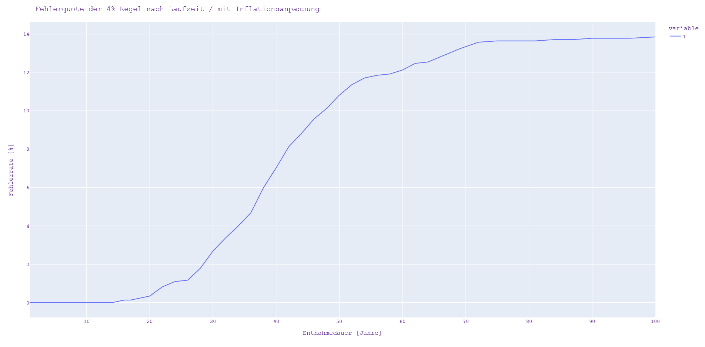
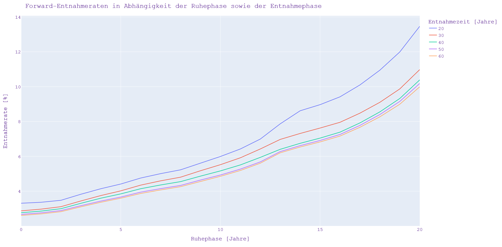
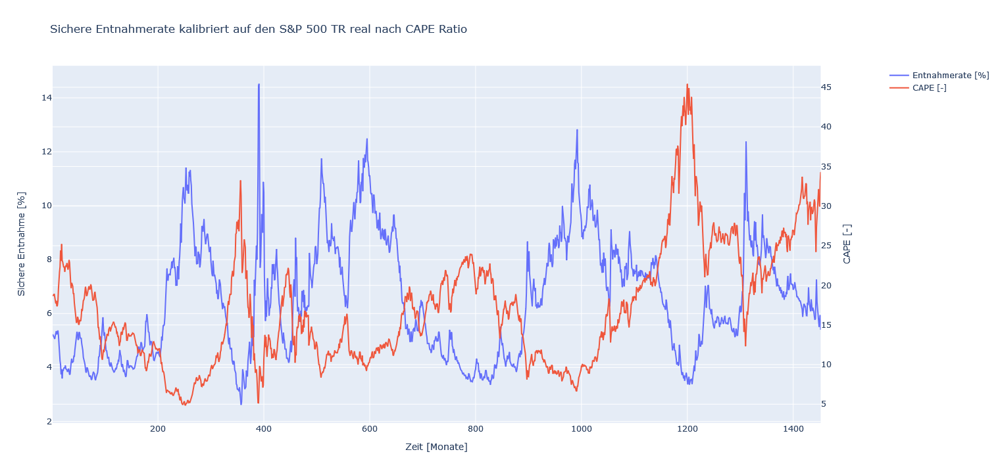

# Finanzen? Simuliert!

Das Python Tool dient zur Bestimmung der sicheren Entnahmerate Portfolio:

* Beliebige Generierung von Vermögensrenditen (historische S&P500, Monte Carlo)
* Beliebige Vermögensallokationsstrategien
* Beliebige Entnahmestrategie (feste Entnahme, variabler Prozentsatz)

Die Ideen und Ansätze für diese frei zugängliche Implementierung basieren auf der Website: [Finanzen? Erklärt!](https://www.finanzen-erklaert.de/)

## 1. Datengrundlage
Die Datengrundlage für die monatliche Berechnungen basieren auf dem S&P500 Daten. Diese Daten inkl. der Inflation sind auf der Webseite:
[Early Retirement Now](https://earlyretirementnow.com/2018/08/29/google-sheet-updates-swr-series-part-28/) als Excel Tabelle verfügbar.

Diese Daten liegen für einen Zeitraum von 01/1871 bis zum aktuellen Zeitpunkt vor. 

Mit dem Python-Skript [ReadExel.py](https://github.com/ThoEngel/rentenplanung/blob/main/ReadExcel.py) werden die benötigen Daten extrahiert
und in eine Pickle-Datenstruktur exportiert:

```
print(return_df.head())

   month    year    stocks       cpi        cap
0    1.0  1900.0  0.016413  0.000000  18.674275
1    2.0  1900.0  0.008983  0.012048  18.703797
2    3.0  1900.0  0.011084  0.000000  18.775793
3    4.0  1900.0  0.015894  0.000000  18.936402
4    5.0  1900.0 -0.020935 -0.023809  18.403197
....

```

## 2. Entnahme-Simulation

## 2.1. Analyse der 4% Regel
Im Oktober 1994 wurde die [Trinity-Studie](http://www.retailinvestor.org/pdf/Bengen1.pdf) durch William Bengen veröffentlich. Diese Studie, besser bekannt unter der 4%-Regel 
wird im folgenden mit Hilfe der o. g. Daten validiert. 
Im Gegensatz zu der Trinity-Studie wird der Aktienanteil auf 100% gesetzt, da Anleihen aktuell sowie in der Zukunft wohl keine oder nur geringe Rendite bringen.

Mit dem Python-Skript [Entnahmesimulation.py](https://github.com/ThoEngel/rentenplanung/blob/main/Entnahmesimulation.py) wird die 4% Regel für unterschiedliche Laufzeiten berechnet.
Das folgende Bild zeigt die Fehlerquote der 4%-Regel über eine Laufzeit von 0-100 Jahren.



### 2.2. Sichere Entnahmerate 
Das folgende Bild zeigt die Auswertung der sicheren Entnahmerate nach Laufzeit sowie in Abhängigkeit von vier verschiedenen Fehlerquoten:


Das Python-Skript [Entnahmesimulation.py](https://github.com/ThoEngel/rentenplanung/blob/main/SichereEntnahme.py) berechnet für jede Laufzeit sowie Fehlerquote die maximal mögliche Entnahmerate.
Diese Berechnung der Entnahmerate erfolgt über eine Optimierung der sogenannten sukzessiven Approximation (schrittweise Annäherung).

### 2.3. Forward-Entnahmerate
Bei der Berechnung der Forward-Entnahmerate wird berechnet, wie sich ein verzögerter Start der Entnahmephase auf die Entnahmerate auswirkt. 
Die folgende Implementierung und Auswertung bezieht sich auf den [Finanzen?Erklärt! Blog](https://www.finanzen-erklaert.de/) Artikel: [Mit der Forward-Entnahmerate steigert Jana ihr Budget um 38%](https://www.finanzen-erklaert.de/forward-entnahmerate/)

Da bei der Auswertung die Ruhephase von 0 ... 20 Jahren und die Entnahmephase bei 20, 30, 40, 50 und 60 Jahren berechnet wird,
sind somit insgesamt 21 x 5 = 105 Optimierung durchzuführen. In einem Optimierungslauf werden alle 1440 Epochen (01/1900 - 12/2020) mit der jeweilige Laufzeit (Ruhephase + Entnahmephase) berechnet. 
Dies ist sehr rechenintensiv und wurde daher auf die einzelnen Rechenkerne aufgeteilt. 
 

Mit dem Python-Skript [ForwardEntnahmerate.py](https://github.com/ThoEngel/rentenplanung/blob/main/ForwardEntnahmerate.py) werden die folgenden Entnahmen in Abhängigkeit der Entnahmedauer sowie der Ruhephase berechnet:

```
Ergebnis: Forward Entnahmeraten in Abhängigkeit der Ruhephase (Zeile) sowie der Entnahmephase (Spalte):
+----+----------+----------+----------+----------+---------+
|    |       20 |       30 |       40 |       50 |      60 |
|----+----------+----------+----------+----------+---------|
|  0 |  3.30969 |  2.87329 |  2.76587 |  2.66919 | 2.60876 |
|  1 |  3.36443 |  2.97058 |  2.85759 |  2.75777 | 2.69784 |
|  2 |  3.47825 |  3.11197 |  2.9966  |  2.88759 | 2.82575 |
|  3 |  3.82569 |  3.4404  |  3.3056  |  3.16871 | 3.10459 |
|  4 |  4.14218 |  3.74985 |  3.59928 |  3.43228 | 3.366   |
|  5 |  4.41177 |  4.02002 |  3.84583 |  3.66333 | 3.59857 |
|  6 |  4.75568 |  4.34868 |  4.14281 |  3.94671 | 3.87052 |
|  7 |  5.00759 |  4.59444 |  4.35755 |  4.14729 | 4.0727  |
|  8 |  5.22633 |  4.80425 |  4.54951 |  4.33111 | 4.26028 |
|  9 |  5.61012 |  5.17365 |  4.86527 |  4.6389  | 4.56255 |
| 10 |  5.99151 |  5.52126 |  5.16462 |  4.92879 | 4.85494 |
| 11 |  6.4223  |  5.91669 |  5.50751 |  5.26674 | 5.18842 |
| 12 |  6.9908  |  6.42212 |  5.9407  |  5.68082 | 5.60643 |
| 13 |  7.86483 |  6.97162 |  6.40393 |  6.2726  | 6.20385 |
| 14 |  8.61463 |  7.31271 |  6.74695 |  6.61315 | 6.53695 |
| 15 |  8.96529 |  7.62388 |  7.04701 |  6.91075 | 6.82764 |
| 16 |  9.41477 |  7.95384 |  7.38888 |  7.25501 | 7.16321 |
| 17 | 10.097   |  8.47786 |  7.91853 |  7.77644 | 7.66756 |
| 18 | 10.9444  |  9.10072 |  8.55217 |  8.39966 | 8.26846 |
| 19 | 11.9901  |  9.86973 |  9.32044 |  9.15176 | 8.99137 |
| 20 | 13.4617  | 10.9776  | 10.3878  | 10.1836  | 9.99084 |
+----+----------+----------+----------+----------+---------+
Simulationsdauer: 30641 sec. = ca. 8 Std.
```

Das folgende Bild zeigt die o. g. Entnahmerate grafisch an.


Die sichere Entnahmerate wächst Prozentual wie folgt: 


### 2.4. Entnahmestrategien optimieren – bessere Rente dank CAPE Ratio
Bei der folgenden Berechnung wird der Zusammenhang zwischen Entnahmerate und CAPE Ratio analysiert.

Die folgende Implementierung und Auswertung bezieht sich auf den [Finanzen?Erklärt! Blog](https://www.finanzen-erklaert.de/) Artikel: [Entnahmestrategien optimieren – bessere Rente dank CAPE Ratio](https://www.finanzen-erklaert.de/entnahmestrategien-optimieren-bessere-rente-dank-cape-ratio/)

Auswertung der sicheren Entnahmerate und dem CAPE Ratio (60 Jahren Entnahmezeit, S&P500 real vpn 1900-2020):



Auswertung der sicheren Entnahmerate in Abhängigkeit vom CAPE (60 Jahren Entnahmezeit, S&P500 real von 1900-2020):


Das Python-Skript [SichereEntnahmeCAPE.py](https://github.com/ThoEngel/rentenplanung/blob/main/SichereEntnahmeCAPE.py) berechnet für jeden möglichen Startzeitpunkt (12 Monate x 120 Jahre = 1440) eine maximale Entnahmerate.

### 2.5. Risikoermittlung während der Entnahmephase

Die folgende Implementierung und Auswertung bezieht sich auf den [Finanzen?Erklärt! Blog](https://www.finanzen-erklaert.de/) 
Artikel: [Erkennen, wenn die Pleite droht – besteht während der Entnahmephase Handlungsbedarf?](https://www.finanzen-erklaert.de/wann-besteht-in-der-entnahmephase-handlungsbedarf/)

Mit Hilfe des folgenden Python-Skripts [SichereEntnahmePleiteRisiko.py](https://github.com/ThoEngel/rentenplanung/blob/main/SichereEntnahmePleiteRisiko.py) lässt sich die folgende Auswertung ermitteln:

**Achtung**: Die Achsenzuordnug ist umgedreht zum Original-Artikel.


Mittels der folgenden Konfiguration kann die Entnahmerate (fixed_pct) sowie der Entnahmezeitraum (n_ret_years) an seine Bedürfnisse angepasst werden:

```
    config = {
        'date': {'start': mDate(1, 2022),              # Start Datum
                 'start_retirement': mDate(1, 2022)},  # Start der Entnahme
        'assets': {'depot': 100,                       # Depotvolumen zum Startzeitpunkt
                   'fees': 0.00},                      # Jährliche Depotgebühren in %
        'simulation': {'returns_df': real_return_df,   # S&P500 Daten
                       'n_ret_years': 30},             # Simulationsdauer in Jahren
        'withdrawal': {'fixed_pct': 4.0},              # Proz. Entnahmerate pro Jahr vom Startdepot
        'visualization': {'textoutput': False}         # Textueller Zwischenausgaben als Debug Info
    }
```


## 3. Berücksichtigung von zukünftigen Assets bei der Rentenplanung
Innerhalb des Erwerbslebens werden Rentenpunkte gesammelt. Diese Rentenpunkte ergeben mit dem aktuellen Rentenwert (2021: 34,19€ in Westdeutschland) eine monatliche Rente.
Diese wird ab dem Rentenalter (in der Regel ab 67 Jahren) ausgezahlt. Eine zusätzliche monatliche Rente hat einen Einfluss auf die Entnahmerate, da ab Rentenbeginn weniger aus dem Depot entnommen werden muss. 

Im Folgenden werden die Python-Skripte um eine zusätzliche Komponente der gesetzlichen Rente erweitert. 

Hierfür wird die bereits eingeführte Konfiguration um die Renten-Konfiguration (_pension_) erweitert:

```
    config = {
        'date': {'start': mDate(1, 2022),              # Start Datum
                 'start_retirement': mDate(1, 2022)},  # Start der Entnahme
        'assets': {'depot': 500000,                    # Depotvolumen zum Startzeitpunkt
                   'fees': 0.00},                      # Jährliche Depotgebühren in %
        'simulation': {'returns_df': real_return_df,   # S&P500 Daten
                       'n_ret_years': 30},             # Simulationsdauer in Jahren
        'withdrawal': {'fixed_pct': 4.0},              # Proz. Entnahmerate pro Jahr vom Startdepot
        'pension': {'point': np.array([30]),           # Anzahl erworbener Rentenpunkte
                    'point_add': np.array([0.0]),      # Rentenpunktzuwachs pro Jahr
                    'start_date': [mDate(1, 2027)],    # Beginn der gesetzlichen Rente
                    'name': {'John Doe'},              # Name des Rentenbeziehers
                    'point_value': 39.14,              # aktueller Rentenpunktwert
                    'point_value_inc': 0.5},           # Proz. Steigerung des Rentenpunktwertes
        'visualization': {'textoutput': True}          # Textuelle Zwischenausgaben als Debug Info
    }

```

Diese Rentenkonfiguration beinhaltet die bereits erworbenen Rentenpunkte (_point_), den Starttermin der gesetzlichen Rente (_start_date_), 
den Namen der rentenberechtigen Person, die Rentenpunktwert (_point_value_) sowie die jährliche prozentuale Steigerung der 
Rentenpunktwertes (_point_value_inc_). Bei den genannten Werten handelt es sich bis auf dem Rentenpunktwert und Steigerung 
alles um Vektoren, um mehrere Rentenzahlungen zu berücksichtigen (z. B. Mann und Frau zu unterschiedlichen Zeitpunkten mit 
unterschiedlichen Rentenbeträgen).

### 3.1. Gesetzliche Rente mit 63 ist immer die richtige Entscheidung
Die folgende Implementierung und Auswertung bezieht sich auf den [Finanzen?Erklärt! Blog](https://www.finanzen-erklaert.de/) Artikel: [Gesetzliche Rente mit 63 ist immer die richtige Entscheidung](https://www.finanzen-erklaert.de/gesetzliche-rente-mit-63-ist-immer-die-richtige-entscheidung/)

Mithilfe des folgenden Python-Skripts [GesetzlicheRenteMit63.py](https://github.com/ThoEngel/rentenplanung/blob/main/GesetzlicherRenteMit63.py) 
lässt sich eine vorgezogene Rente mit 63 Jahren sowie Rentenabschlag argumentieren:


### 3.2. Simulationsszenario: Kann Mad (42) ab sofort in Rente gehen?
Die folgende Implementierung und Auswertung bezieht sich auf den [Finanzen?Erklärt! Blog](https://www.finanzen-erklaert.de/) Artikel:  [Kann Mad (42) ab sofort in Rente gehen?](https://www.finanzen-erklaert.de/kann-mad-ab-sofort-in-rente-gehen/)

Coming soon ....

**Quellen**: 

[Finanzen?Erklärt!](https://www.finanzen-erklaert.de/) 

[Early Retirement Now](https://earlyretirementnow.com/2018/08/29/google-sheet-updates-swr-series-part-28/)

[Trinity Studie: Determining Withdrawal Rates Using Historical Data](http://www.retailinvestor.org/pdf/Bengen1.pdf)
