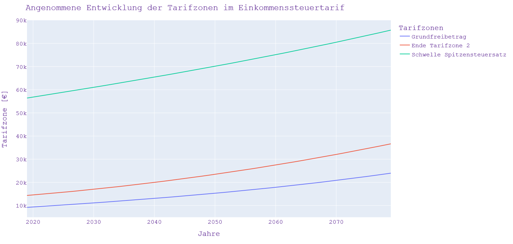
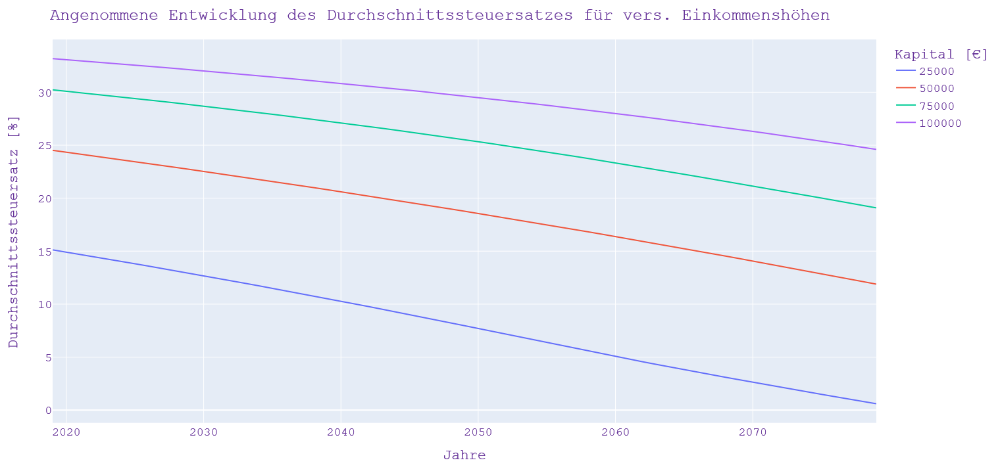

# Steuern

Die folgende Implementierung und Auswertung bezieht sich auf den [Finanzen?Erklärt! Blog](https://www.finanzen-erklaert.de/) Artikel: [Vorsicht vor der 4% Regel (Teil 3) – welchen Einfluss haben Steuern auf die sichere Entnahmerate?](https://www.finanzen-erklaert.de/vorsicht-vor-der-4-regel-teil-3-welchen-einfluss-haben-steuern-auf-die-sichere-entnahmerate/)

Steuer-Parameter im Laufe der Zeit

Daraus ergeben sich im Zeitverlauf für verschiedene zu versteuernde Einkommen die folgenden Durchschnittssteuersätze.

Mit dem Python-Skript [Einkommenssteuertarif.py](https://github.com/ThoEngel/rentenplanung/blob/main/Einkommenssteuertarif.py) werden die oben gezeigten Grafiken erzeugt.
Basis dazu ist die Funktion [CalEst_Forecast.py](https://github.com/ThoEngel/Finanzen-Simuliert/blob/main/SEsimulation/CalEst_Forecast.py) welche aus den zu versteuernden Einkommen (zvE) die Einkommenssteuer (Est) berechnet.

# Berechnung der Nachsteuer-Entnahmerate
Die Berechnung der Nachsteuer-Entnahmerate basiert auf den o. g. Steuerparametern. 
Ausgangspunkt ist die klassische Entnahmerate ohne Berücksichtigung von Steuern. In dem Python-Skript 
wird anschließend in jedem Schritt (monatlich) über ein Iterationsverfahren die notwendige Steuer ermittelt. 
Zusätzliche wird ein Verlusttopf sowie eine virtuelle jährliche Steuererklärung berücksichtigt.

## Quellen:
[STEUERBERECHNUNG FÜR EINKOMMENSTEUERPFLICHTIGE FÜR DIE JAHRE 1958 BIS 2022 ](https://www.bmf-steuerrechner.de/ekst/eingabeformekst.xhtml)