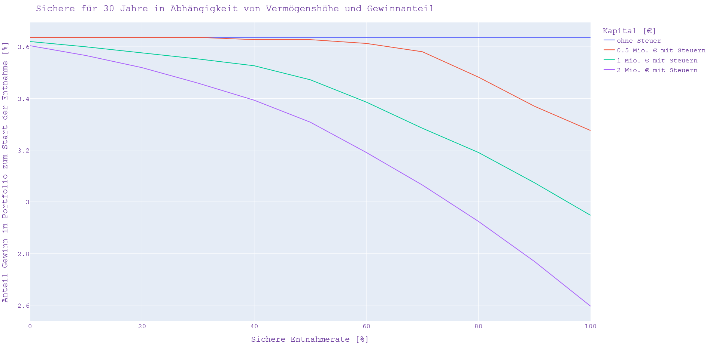

# Steuern

Die folgende Implementierung und Auswertung bezieht sich auf den [Finanzen?Erklärt! Blog](https://www.finanzen-erklaert.de/) Artikel: [Vorsicht vor der 4% Regel (Teil 3) – welchen Einfluss haben Steuern auf die sichere Entnahmerate?](https://www.finanzen-erklaert.de/vorsicht-vor-der-4-regel-teil-3-welchen-einfluss-haben-steuern-auf-die-sichere-entnahmerate/)

Steuer-Parameter im Laufe der Zeit

Daraus ergeben sich im Zeitverlauf für verschiedene zu versteuernde Einkommen die folgenden Durchschnittssteuersätze.

Mit dem Python-Skript [Einkommenssteuertarif.py](https://github.com/ThoEngel/rentenplanung/blob/main/Einkommenssteuertarif.py) werden die oben gezeigten Grafiken erzeugt.
Basis dazu ist die Funktion [CalEst_Forecast.py](https://github.com/ThoEngel/Finanzen-Simuliert/blob/main/SEsimulation/CalEst_Forecast.py) welche aus den zu versteuernden Einkommen (zvE) die Einkommenssteuer (Est) berechnet.

# Berechnung der Nachsteuer-Entnahmerate
Die Berechnung der Nachsteuer-Entnahmerate basiert auf den o. g. Steuerparametern. 
Ausgangspunkt ist die klassische Entnahmerate ohne Berücksichtigung von Steuern. In dem Python-Skript 
wird anschließend in jedem Schritt (monatlich) über ein Iterationsverfahren die notwendige Steuer ermittelt. 
Zusätzliche wird ein Verlusttopf sowie eine virtuelle jährliche Steuererklärung berücksichtigt.

## Ergebnisse
Die folgende Grafik zeigt für eine Entnahmedauer von 30 Jahren die klassische, sichere Entnahmerate 
(ohne Berücksichtigung von Steuern) als waagerechte Linie abgebildet. Die weiteren 3 Kurven darunter stellen 
die Netto-Entnahmeraten für verschiedene Vermögenshöhen (500.000€, 1 Mio.€ und 2 Mio.€) dar. Auf der x-Achse 
ist der Gewinnanteil im Depot zum Start der Entnahmen aufgetragen.

Datenbasis der Auswertung ist der monatliche S&P500 TR Index (real) von 01/1970 - 12/2021 

## Quellen:
[STEUERBERECHNUNG FÜR EINKOMMENSTEUERPFLICHTIGE FÜR DIE JAHRE 1958 BIS 2022 ](https://www.bmf-steuerrechner.de/ekst/eingabeformekst.xhtml)